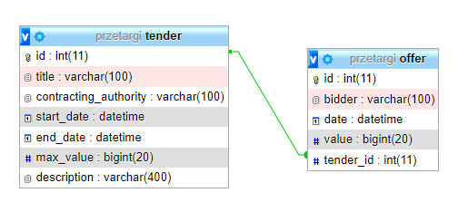

# Aplikacja przetargowa 'Przetargi.pl' - dokumentacja

## Identyfikacja zagadnienia biznesowego
Celem projektu było stworzenie aplikacji internetowej, która umożliwia ogłaszanie przetargów oraz branie w nich udziału poprzez 
składanie za nich ofert. Strona pozwala na łatwe i intuicyjne tworzenie przetargów przez dowolne instytucje oraz osoby,
po podaniu przez nich odpowiednich infomacji. Użytkownicy strony mogą róznież nawigować się po odpowiednich zakładkach
i przeglądać przetargi aktywne, zakończone, oraz te jeszcze nierozpoczęte. W przypadku przetargów aktywnych mogą oni 
wziąć w nich udział poprzez wypełnienie formularza na stronie przetargu i złożenie oferty. Powyższe funkcjonalności 
zostały w pełni zrealizowane przez zaimplementowaną aplikację. Możliwy jest również jej dalszy rozwój poprzez dodanie 
systemu logowania i rejestracji użytkoników, stworzenie historii złożonych ofert i utworzonych przetargów, ich 
modyfikacji, oraz stworzenie systemu autoryzacji.

## Wymagania funkcjonalne
### Funkcjonalności aplikacji
Aplikacja posiada poniższe funkcjonalności:
- wyświetlenie szczegółowych informacji o przeznaczeniu aplikacji,
- wyświetlanie listy przetargów aktywnych i nierozpoczętych, wraz z podstawowymi informacjami: numer porządkowy, 
przedmiot przetargu, data rozpoczęcia i zakończenia przyjmowania ofert, status przetargu,
- wyświetlanie listy zakończonych przetargów, wraz z podstawowymi informacjami: numer porządkowy, przedmiot przetargu,
status, 
- wyświetlanie szczegółowych informacji o danym przetargu
  - w przypadku przetargu aktywnego: nazwa instytucji zamawiającej, opis,
  - w przypadku zakończonego przetargu: nazwa instytucji zamawiającej, opis, status, lista złożonych ofert,
- złożenie oferty w przypadku aktywnego przetargu, poprzez podanie nazwy instytucji/osoby składającej ofertę oraz 
wartości oferty,
- dodanie nowego przetargu.

### Architertura alikacji
Aplikacja została utworzona w oparciu o architekturę `MVC` i składa się z dwóch części: backendowej (serwerowej) oraz 
frontendowej (klienckiej). Strona kliencka napisana została przy użyciu biblioteki `React` oraz `Tailwind` (do stylizacji
widoków) oraz odpowiedzialna jest za renderowanie odpowiednich stron z wykorzystaniem danych otrzymanych od strony 
serwerowej dzięki asynchronicznej komunikacji przy użyciu `REST API`. Część serwerowa natomiast zamplementowana
została przy użyciu środowiska `Node.js` i frameworka `Express`, a odpowiedzialna jest za logikę biznesową aplikacji,
operowanie na danych z bazy danych oraz odpowiadanie na żądania przychodzące od strony klienckiej. Wykorzystywana w 
aplikacji baza danych jest relacyjną bazą `MySQL`, na której operacje odbywają się przy użyciu `Sequelize` 
(odgrywającego rolę `ORM'a`).

## Analiza zagadnienia i modelowanie
### Diagram związków encji


### Przepływ danych
Wysyłane przez część kliencką zapytania na konkretne endpointy, są odbierane po stronie serwera i przesyłane przez 
routing, który uruchamia odpowiednią metodę z kontrolera odpowiedzialną za obsługę danego żądania. Ta z kolei korzysta
z metod serwisu, który odpowiada za logikę biznesową aplikacji, a który wykorzystując metody z warstwy odpowiedzialnej
za dostęp do bazy danych (DAO) pobiera, dodaje lub aktualizuje dane w bazie, a następnie przesyła je do kontrolera.
Ten z kolei otrzymane dane odsyła do klienta jako odpowiedź na żądanie.

### Wykorzystywane endpointy
Dla przetargów: 
- `GET` `/przetargi/aktywne` - pobiera listę aktywnych lub przyszłych przetargów,
- `GET` `/przetargi/aktywne/:id` - pobiera informacje na temat aktywnego lub przyszłego przetargu o podanym `id`,
- `GET` `/przetargi/zakonczone` - pobiera listę zakończonych przetargów,
- `GET` `/przetargi/zakonczone/:id` - pobiera informacje na temat zakończonego przetargu o podanym `id`,
- `POST` `/przetargi/dodaj` - dodaje nowy przetarg,

Dla ofert:
- `GET` `/oferty/:tender_id` - pobiera listę ofert dla przetargu o podanym `id` (`tender_id`),
- `POST` `/oferty/dodaj/:id` - dodaje nową ofertę dla przetargu o podanym `id`.

## Implementacja
Część serwerowa aplikacji zaimplementowana została przy użyciu środowiska `Node.js` oraz frameworka `Express`. Korzysta
ona również z ORM'a - `Sequelize`, który dpowiedzielny jest za obsługę bazy danych, napisanej w MySQL. Konfiguracja
tego narzędzia znajduje się w pliku `/backend/models/sqConfig.js`:

```js
// Modele danych
db.offer = require("./offer.js")(sequelize, Sequelize);
db.tender = require("./tender.js")(sequelize, Sequelize);

// Powiazania bazodanowe pomiedzy modelami
db.tender.hasMany(db.offer, {foreignKey: 'tender_id', as: 'tender_id'}); // jeden - do wielu (1-N)
db.offer.belongsTo(db.tender, {foreignKey: 'tender_id'}); // zwiazek encji
```
W powyższym kodzie określone są modele znajdujące się w bazie oraz relacje między nimi.

Wykorzystane wyżej modele znajdują się w folderze `/backend/models`. Przykład modelu reprezentującego przetarg w bazie
danych:
```js
module.exports = (sequelize, Sequelize) => {
    const Tender =  sequelize.define("tender", {
            title: {
                type: Sequelize.STRING,
                allowNull: false
            },
            contracting_authority: {
                type: Sequelize.STRING,
                allowNull: false
            },
            start_date: {
                type: Sequelize.DATE,
                allowNull: false
            },
            end_date: {
                type: Sequelize.DATE,
                allowNull: false
            },
            max_value: {
                type: Sequelize.INTEGER,
                allowNull: false
            },
            description: {
                type: Sequelize.STRING,
                allowNull: true
            },
        },
        { tableName: 'tender' });
    return Tender;
};
```

Z modeli korzysta warstwa DAO, odpowiedzialna za przeprowadzanie operacji na bazie danych. Odpowiednie jej pliki 
znajdują się w folderze `/backend/dao`. Dla przykładu, w pliku `tenderDao.js` znajduje się funkcja odpowiedzialna za
pobranie wszystkich aktywnych przetargów, czyli takich, których data zakończenia jest datą późniejszą niż obecna data.
Część jej kodu odpowiedzialna za pobranie z bazy odpowiednich rekordów wygląda następująco:

```js
return Tender.findAll({
    where: {
        end_date: {
            [Op.gte]: now
        }
    },
    order: [['end_date', 'ASC']]
})
```

W przypadku wystąpienia błędu, tworzony jest i zwracany niestandardowy wyjątek (zdefiniowany w folderze `/backend/errors`): 
```js
.catch(() => {
    return new ServerError("tenderFindAllActive() error", 500);
})
```

Metody warstwy DAO wykorzystywane są przez serwisy, odpowiedzialne za logikę biznesową aplikacji 
i umieszczone są w folderze `/backend/services`. W nich następuje walidacja danych, po czym zwracane są odpowiednie 
wartości. Przykładem jest kod poniższej funkcji odpowiedzialnej za dodanie nowej oferty dla przetargu, która korzysta
z metody DAO `createOffer()`. W przypadku błędu zwracany jest niestandardowy wyjątek.
```js
const createOffer = async (id, bidder, value) => {
  const activeTender = await tenderService.getActiveTender(id);
  if (activeTender.id){
    return  await offerDao.createOffer(id, bidder, value)
  } else {
    throw new ServerError("getActiveTender() error", 500)
  }
}
```

Z metod serwisów korzystają z kolei kontrolery, które w zależności od otrzymanych danych zwracają odpowiednią odpowiedź.
Kontrolery znajdują się w folderze `/backend/controllers`, a poniższy przykład jednego z nich (`offersController.js`)
zwraca otrzymane dane w pzrypadku pomyślnego wykonania operacji, lub błąd w przeciwnym wypadku:
```js
const addOffer = async (req, res) => {
    try {
        const addedInfo = await offerService.createOffer(req.params.id, req.body.bidder, req.body.value);
        res.status(200).json({ data: addedInfo})
    } catch (e) {
        res.status(e.code).json({status: e.code})
    }
}
```

Natomiast z metod kontrolerów korzystają routingi (umieszczone w folderze `/backend/routes`), które obsługują i delegują 
żądania przychodzące od strony klienckiej. Poniżej znajduje się funkcja z pliku `/backend/routes/offers.js` obsługująca
żądanie dodania nowej oferty:
```js
router.post('/dodaj/:id', offersController.addOffer);
```

Klient został zimplementowany przy użyciu biblioteki `React` oraz `Tailwind`, a do wysyłania asynchronicznych zapytań
wykorzytano bibliotekę `Axios` (`/frontend/src/Api.tsx`):
```js
const Api = axios.create({
    headers: {
        "Content-Type": "application/json",
    },
    baseURL:  "http://localhost:3000",
});
```

Zapytania wysyłane są w komponentach (zdefiniowanych w folderze `/frontend/src/components`) przy użyciu `hooków`. Poniżej
znajduje się przykład pozwalający na pobranie listy zakończonych przetargów i zapisanie ich w zmiennej:
```js
const completedTenders = useQuery<Tender[]>({
    queryKey: ["completedTenders"],
    queryFn: () => {
        return Api.get("przetargi/zakonczone")
            .then((res) => res.data)
            .catch(() => {
                setError("Błąd w czasie pobierania zakończonych przetargów")
            })
    },
    enabled: true,
})
```

`Hooki` wykorzystywane są również do zarządzania danymi w komponentach. W poniższym przypadku zastosowano `useState` do 
przechowywania informacji przekazywanych w formularzu obsługującym dodawanie przetargów oraz informacji o błędach:
```js
const [startDate, setStartDate] = useState<Date>(null)
const [dateError, setDateError] = useState("")
const [info, setInfo] = useState("")

const handleEndDateChange = (e) => {
  setInfo("")
  setDateError("")
  setEndDate(new Date(e.target.value))
}
```

Kontrolery odpowiadają za wyświetlanie treści na stronie pod konkretym adresem http, za co odpowiada routing 
zaimplementowany w pliku `/frontend/src/` przy użyciu bilioteki `React Router`:
```js
<Routes>
    <Route path="/" element={<HomePage/>}></Route>
    <Route path="/aktywne" element={<ActiveTenders/>}></Route>
    <Route path="/aktywne/:id" element={<ActiveTender/>}></Route>
    <Route path="/zakończone" element={<CompletedTenders/>}></Route>
    <Route path="/zakończone/:id" element={<CompletedTender/>}></Route>
    <Route path="/dodaj" element={<NewTender/>}></Route>
</Routes>
```

## Podsumowanie
Zaimplemetowana aplikacja jest w pełni działającą stroną i spełnia wymagania zdefiniowane w pierwszym rozdziale. Podczas 
implementacji dzięki użytym technologiom, ich bibliotekom, architekturze MVC nie napotkano na większe trudności. Kod jest 
prosty i intuicyjny, co dodatkowo pozwala na dalsze rozszerzanie aplikacji, jak chociażby: dodanie
systemu logowania i rejestracji użytkoników, stworzenie historii złożonych ofert i utworzonych przetargów, ich
modyfikacji, czy stworzenie systemu autoryzacji.